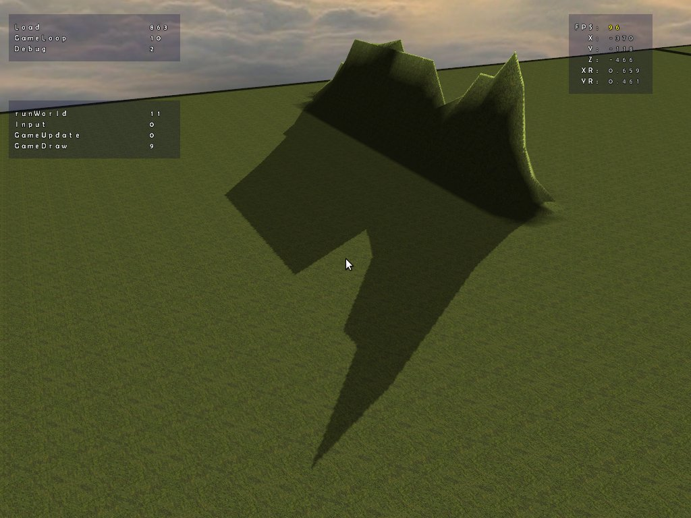

# How This Project Started
This project essentially started over 10 years ago using RPG Maker XP with a copy I had downloaded and later discovered was a hacked version of the software. After realising that as well as noticing some limitations to the program in general me and my brother decided we should make a game from scratch. 
 
 
So I decided to try C# and learned about Microsoft XNA and created a basic engine with a character that could walk around a 2D world with some trees. I quickly discovered that some of the things I wanted to do were difficult or limited, and I also didn't mch like being tied down to windows and would much rather use Linux. I eventually heard that XNA was going to be discontinued and therefore decided to try and make the switch to C++ which I had already been using in the past for console applications. 
 
 
I had to do some research on how to program a graphical application on Linux and quickly found SDL to be very easy to use. I had created again a 2D world that I could walk around on with trees. I eventually learned that SDL was capable of using OpenGL directly and so I enabled it, created 2D geometry for the world and trees and added some extra things like lighting so the ground and trees would illuminate as I walked around. But then I wondered, if this is OpenGL then I should be able to walk around in 3D. After messing with a few variables and figuring out how to create a perspective matrix my game was suddenly in 3D. The world was build vertically instead of horizontally but that turned out to be a fairly easy fix and soon I had a flat 3D world with trees. 
 
 
 
By this point it had already been a good 5 years of going back and forth trying to figure out how I wanted to do this. At the time I was using OpenGL 3.2 if I recall correctly, before core profile and shaders were mandatory. I created a world with 3D terrain using a very crude binary map file with heightmap data. I had the terrain shading working and even had shadows working. The 2D trees would billboard and I even added an effect for 3D glasses just for fun. I eventually learned however that OpenGL was going to be switching to core profile entirely requiring shaders be written and I had to make a choice. I decided I was going to start over and rewrite the game using nothing but OpenGL 4.2 core profile with shaders. The original name of the project was Project Destroyer which is named after a mock up game I had made and was the first game I made in RPG Maker XP. 
 
 
 
A lof of the game engine had to be rewritten and the OpenGL Superbible was used extensively to get up a running. To this day some of the managers such as the shader loader is closely based on the examples from that book. Although I have made many modifications to make it suit my more extensive needs. Lighting took a hit in this move as the basic light source that followed the character around no longer existed. Shadows were scrapped and have never been re-implemented but isn't considered a necessary feature at this point anyways. The ground terrain was rewritten still using a binary heightmap file and trees were reimplemented. However at this point I created a PLY loader that could take 3D models made in Blender and import them into the game. At first it was a few statues, but eventually I had a castle in the style of Killkenny castle that I had modeled. 
 
 
 
I created events that would allow me to press the enter key and activate it. At the time it simply sent me to a dungeon system using a 3D grid that I could fly around in. I then created a system of worlds that could be switched to at any time like changing dimensions. 
 
 
 
At one point, the game starts crashing, and crashing, and crashing. Eventually I find that the memory use is spiking out of control and causing the game to crash. I learned about valgrind and did a memory leak test. I found that there were so many memory leaks that I had a hard time trying to figure out where to start. Because of my use of pointers and not properly cleaning them up from very early on I had created a huge problem. It took about a week of troubleshooting but I eventually got most of the leaks under control. I decided that for now I would continue with the fun stuff. 
 
 
I now had a sky with moving sun, clouds, and stars and added lens flare with rippling water. The sky would change to a gradient of orange to blue where the sun rose and set. Flora would spawn around you as walked around and different flora would spawn underwater. Grass could be enabled that would randomly sway and followed the terrain. A menu system was working for an admin menu and in-game menu to perform certain actions. You could enter battle with NPCs that were statically placed on the world and you could even do full battle with them using a turn based system. Basic bounding volumes were created around 3D objects and you could toggle them visually on and off. A magic system was in the works with a book and even better was the player journal that was a Stonekeep style book with stats, inventroy, a multiple layers of armor and player health status. The world was now also switched to PLY format and could be modeled using Blender and stitched together when the game loaded. 
 
 
 
 
Weather effects were added including rain, snow, and hail. A simple LOD system was in the works to reduce excesssive geometry on the world map. 
 
 
At this point the engine was coming along quite well and I had a large detailed world modeled in Blender and groups of NPCs throughout the world that you could battle although many systems were only partially built and many things didn't work properly. Lighting on 3D objects and 2D objects was inconsistent if itworked at all. When trying to implement a lamp that followed the character around I found it couldn't be done properly due to some sort of scaling issues. This short list of problems pales in comparison to all of the issues and roadblocks. With these issues in mind I decided to again rewrite the engine from scratch using all of the systems I had already created and implement them one at a time in a new engine. That is this engine which has come a long way so far. 
 
# Project State When Added to Github (2020-07-18)
The new name of the project became Project Parsec at this point because the goal was no longer to make the original game intended but rather to consider a simpler game. As the name implies it was meant to be a space game using some concepts from many games I have played such as X-Wing, Eve Online, Vendetta, Freespace, etc as well as several books such as the Star Carrier series. This is the current end goal with an RPG game as the follow up end goal. But I want the engine to be versatile so that any game type can be created with it. Not to try and complete with the Unity engine or anything like that, but just as a hobby for myself. 
 
 
In its current state most of the basic systems have been implemented aside from the atmosphere which is fairly complex and includes flora, weather, skybox, clouds, exosphere, and several other items. A particle system has been created but not finished, it still has some memory leaks when particles fade out but the basic system works fine. 
 
 
The 3D object loader has been fixed so there are no longer memory leaks when loading 3D models. Lighting has been fixed on 3D objects and even a lighting system has been created to manage lights that can simply be added to the system and automatically passed to shaders. Direct, spot, and area lights can be created. Although processing of multiple lights can be fairly intensive as nothing has been optimized. Post processing has been added for additional effects and new effects can be easily added. There is also preliminary collision and bounding volume systems currently providing mouse ray intersection. There is sphere, box, and cylinder shapes and can be axis aligned or object aligned. 
 
 
 
There are several systems such as the sprite, icon, and text systems that used to be used to create menus along with a menuSys class. That has been scrapped a new set of GUI classes has been created for a mush more powerful menu system including windows, labels, fields, sliders, icons, buttons, checkbox, loading bar, textbox, etc. These items can be nested as much as needed and are automatically hidden whenever a parent object is hidden. You can tie buttons, sliders, checkboxes, and fields to external values as well as set up multiple internal states for buttons, icons, and checkboxes. 
 
 
 
 
The world map is no longer based on a heightmap but on layers of simplex noise. It is not complete but currently uses two layers of noise that can be adjusted in the admin menu live. Although high resolution meshes can tremendously slow down the engine. No LOD is implemented yet but some ideas are in the works. 2D objects can be loaded and billboarding works but lighting is not correct as the normal is not updated during billboarding. The audio system is working but not fully finished yet as there isn't much to tie it to yet. It does work with the GUI and animated sprites. 
 
 
 
 
There is still a lot work left to be done but the new engine is showing a lot of promise. There are a few things I want to finish in the GUI system and then I want to work on the world map, atmosphere, and particle system classes.
 

